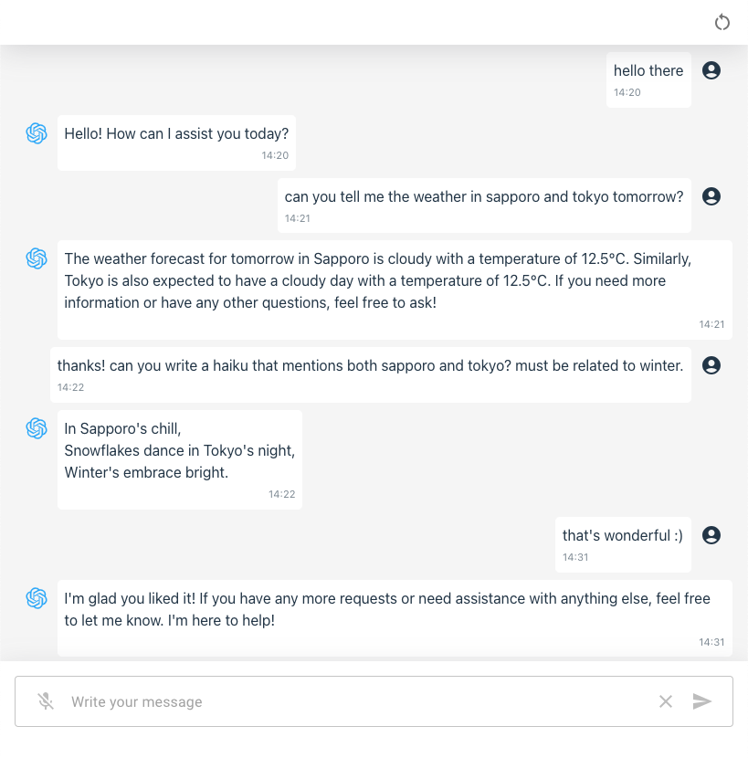
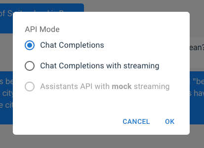

react-chatbot
===========

This is a sample chatbot application built using [Vite + React](https://vitejs.dev/guide/) and powered by OpenAI API.


# Application



I am using the latest model, `gpt-3.5-turbo-0125`, which can handle parallel function calling.

As of now, it just have one sample function, `get_weather`:

```javascript
{
    "name": "get_weather",
    "description": "Get the weather for a specified location and date",
    "parameters": {
        "type": "object",
        "properties": {
            "location": {
                "type": "string",
                "description": "The city, e.g. Tokyo, New York"
            },
            "date": {
                "type": "string",
                "description": "The date for the weather forecast, e.g. today, 2023-10-19"
            }
        },
        "required": ["location", "date"]
    }
}
```

I will add more functions in the future.

Currently, there is no external API where we get the actual weather.


# API Modes

Click the **Settings** icon from the top left corner to open the Settings dialog.



We can call the API by different modes:

* [Chat Completions](#chat-completions)
* Chat Completions with streaming (default)
* Assistants API with ***mock*** streaming (not yet available)

Most people will probably just use **Chat Completions with streaming**. But sometimes streaming might not be necessary and depending on the limitation of your backend provider, you might be stuck without streaming option. So I am putting it here for reference in case someone might need it.


## Chat Completions

Refer to `submitQuery` function from [App.jsx](/react-chatbot/src/App.jsx) which handles the non-streaming request.

```javascript
let is_completed = false
let max_loop = 30
let count = 0

let tool_calls = []

do {

    let payload = { previous }
    let relurl = 'chat'

    if(tool_calls.length > 0) {

        payload.tool_calls = tool_calls
        relurl = 'chat/tools'

    } else {

        payload.query = message

    }
    
    const response = await fetch(`${this.baseUrl}/${relurl}`, {
        method: 'POST',
        headers: {
            'Accept': 'application/json',
            'Content-Type': 'application/json'
        },
        body: JSON.stringify({
        previous,
        query: message,
        tool_calls,
        })
    })

    const result = await response.json()

    if(result.message.tool_calls) {

        if(message) {

            previous.push({ role: 'user', content: message })

            message = ''

        }

        if(result.message.content) {

            previous.push({ role: 'assistant', content: result.message.content })

        }

        tool_calls = result.message.tool_calls

    } else {

        is_completed = true

    }

    count++

    if(count >= max_loop) {
        is_completed = true
    }

} while(!is_completed)
```

If you are going to implement a chatbot with tools, you will need to enclose your API call in a loop to handle subsequent API calls that the AI might be invoked.

If there are no tool calls, we immediately set `is_completed` to true. However, as long as we receive tool calls, we call the API again. So that it will be much easier to understand, I separate the endpoint that handles the tool calls. See `/chat/tools` handler from [chat.js](/server/src/routes/chat.js).

I am doing this so that the message content that the AI might send in between API calls can be handled and written in the UI. This is where you might see, "Please wait for awhile..." as the AI process the request.

We are also putting a guard to prevent the AI from calling too many API calls. I set the maximum loop to 30 but you can just adjust it.


## Chat Completions with streaming

Refer to `submitQueryStream` function from [App.jsx](/react-chatbot/src/App.jsx) which handles the streaming request.

```javascript
const response = await fetch(`${this.baseUrl}/chat/stream`, {
    method: 'POST',
    headers: {
        'Accept': 'application/json',
        'Content-Type': 'application/json'
    },
    body: JSON.stringify({
        query: message,
        previous
    })
})

const reader = response.body.getReader()

let is_completed = false
let text_data = ''

while(!is_completed) {

    const { done, value } = await reader.read()

    if(done) {
        is_completed = true
        break
    }

    text_data += new TextDecoder().decode(value)

    this.setState((prev) => ({
        messageItems: prev.messageItems.map((item) => {
        return {
            ...item,
            content: item.id === assistant_id ? text_data : item.content
        }
        })
    }))

}
```

As you can see from the simplified snippet, we just call the streaming endpoint once then get all the texts spewed, assemble it in the UI, and just wait until streaming is done or aborted.

In reality, if you look in the [/chat/streaming](/server/src/routes/chat.js) handler, when the request invokes tool calls we are actually also doing a loop to handle subsuquent API calls, like the one we did in non-streaming mode.


# Setup

Copy `.env.example` and rename it to `.env` then edit values according to your own configuration.
Please note that this should coincide with your [server setup](/server/README.md#setup).

```sh
VITE_SERVER_HOST=192.168.0.1
VITE_SERVER_PORT=3000
VITE_SERVER_PROTOCOL=https
```

To run the application

```bash
bun start
``

Open your browser to `http://localhost:5173/` to load the application page.
