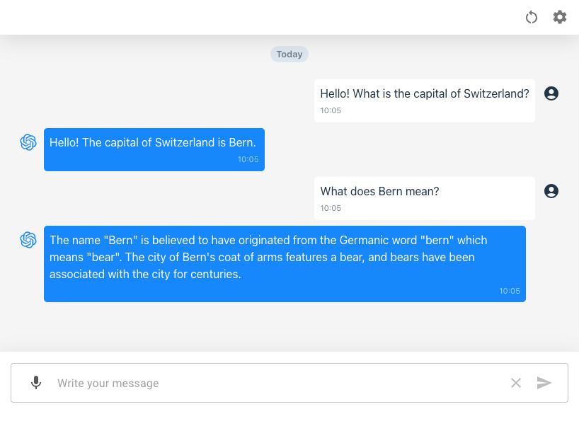

react-chatbot
===========

This is a sample chatbot application built using [Vite + React](https://vitejs.dev/guide/) and powered by OpenAI API.


# Application



You can submit message using the text input or use audio capture.
Click the mic icon to enable audio capture.

Recording will only start if voice or sound is detected. You can adjust the sensitivity of the detection by tweaking the value of `MIN_DECIBELS`. By default the values is set at **-50dB**. Recording will stop and the audio sent to the backend for transcription if no audio is detected for **2500ms**. This is the average range of pause in normal speech. You can adjust this value by editing `MAX_PAUSE`.

Transcription will be done by either the locally installed [Whisper python module](https://github.com/openai/whisper) or [Whisper API](https://platform.openai.com/docs/guides/speech-to-text). Check the [/transcribe](/server/src/routes/transcribe.js) endpoint handler in the server. You will also need to install `ffmpeg` as I use it to remove silent parts from the uploaded audio data.

I am using the latest model, `gpt-3.5-turbo-0125`, for the Chat Completions API, which can handle parallel function calling.

As of now, it just have one sample function, `get_weather`:

```javascript
{
    "name": "get_weather",
    "description": "Get the weather for a specified location and date",
    "parameters": {
        "type": "object",
        "properties": {
            "location": {
                "type": "string",
                "description": "The city, e.g. Tokyo, New York"
            },
            "date": {
                "type": "string",
                "description": "The date for the weather forecast, e.g. today, 2023-10-19"
            }
        },
        "required": ["location", "date"]
    }
}
```

I will add more functions in the future.

Currently, there is no external API where we get the actual weather.


# API Modes

Click the **Settings** icon from the top left corner to open the Settings dialog.


We can call the API by different modes:

* Chat Completions
* Chat Completions with streaming
* Assistants API with ***mock*** streaming (not yet available)

Most people will probably just use **Chat Completions with streaming**. But sometimes streaming might not be necessary and depending on the limitation of your backend provider, you might be stuck without streaming option. So I am putting it here for reference in case someone might need it.


## Chat Completions

Refer to `submitQuery` function from [App.jsx](/react-chatbot/src/App.jsx) which handles the non-streaming request.

```javascript
let is_completed = false
let max_loop = 30
let count = 0

let tool_calls = []

do {

    let payload = { previous }
    let relurl = 'chat'

    if(tool_calls.length > 0) {

        payload.tool_calls = tool_calls
        relurl = 'chat/tools'

    } else {

        payload.query = message

    }
    
    const response = await fetch(`${this.baseUrl}/${relurl}`, {
        method: 'POST',
        headers: {
            'Accept': 'application/json',
            'Content-Type': 'application/json'
        },
        body: JSON.stringify({
        previous,
        query: message,
        tool_calls,
        })
    })

    const result = await response.json()

    if(result.message.tool_calls) {

        if(message) {

            previous.push({ role: 'user', content: message })

            message = ''

        }

        if(result.message.content) {

            previous.push({ role: 'assistant', content: result.message.content })

        }

        tool_calls = result.message.tool_calls

    } else {

        is_completed = true

    }

    count++

    if(count >= max_loop) {
        is_completed = true
    }

} while(!is_completed)
```

If you’re planning to implement a chatbot with tools, it’s necessary to enclose your API call within a loop. This loop will handle any subsequent API calls that the AI might invoke. If there are no tool calls, we immediately set `is_completed` to true. However, if we continue to receive tool calls, we make another API call.

To simplify understanding, I’ve separated the endpoint that manages the tool calls. You can refer to the `/chat/tools` handler in [chat.js](/server/src/routes/chat.js).

This approach ensures that any message content the AI might send between API calls can be properly managed and displayed in the UI. This is why you might see a message like, ***‘Please wait for a while…’*** as the AI processes the request.

We’ve also implemented a safeguard to prevent the AI from making excessive API calls. I’ve set the maximum loop count to 30, but this can be adjusted as needed.

## Chat Completions with streaming

Refer to `submitQueryStream` function from [App.jsx](/react-chatbot/src/App.jsx) which handles the streaming request.

```javascript
const response = await fetch(`${this.baseUrl}/chat/stream`, {
    method: 'POST',
    headers: {
        'Accept': 'application/json',
        'Content-Type': 'application/json'
    },
    body: JSON.stringify({
        query: message,
        previous
    })
})

const reader = response.body.getReader()

let is_completed = false
let text_data = ''

while(!is_completed) {

    const { done, value } = await reader.read()

    if(done) {
        is_completed = true
        break
    }

    text_data += new TextDecoder().decode(value)

    this.setState((prev) => ({
        messageItems: prev.messageItems.map((item) => {
        return {
            ...item,
            content: item.id === assistant_id ? text_data : item.content
        }
        })
    }))

}
```

In the simplified snippet provided, you can see that we only call the streaming endpoint once. We then gather all the emitted text, assemble it within the user interface, and simply wait until the streaming process is either completed or aborted.

However, if you check into the [/chat/streaming](/server/src/routes/chat.js) handler, you’ll notice that when the request triggers tool calls, we also execute a loop to manage subsequent API calls, similar to the process we follow in non-streaming mode.


# Setup

Copy `.env.example` and rename it to `.env` then edit values according to your own configuration.
Please note that this should coincide with your [server setup](/server/README.md#setup).

```sh
VITE_SERVER_HOST=192.168.0.1
VITE_SERVER_PORT=3000
VITE_SERVER_PROTOCOL=https
```

To run the application

```bash
bun start
``

Open your browser to `http://localhost:5173/` to load the application page.
